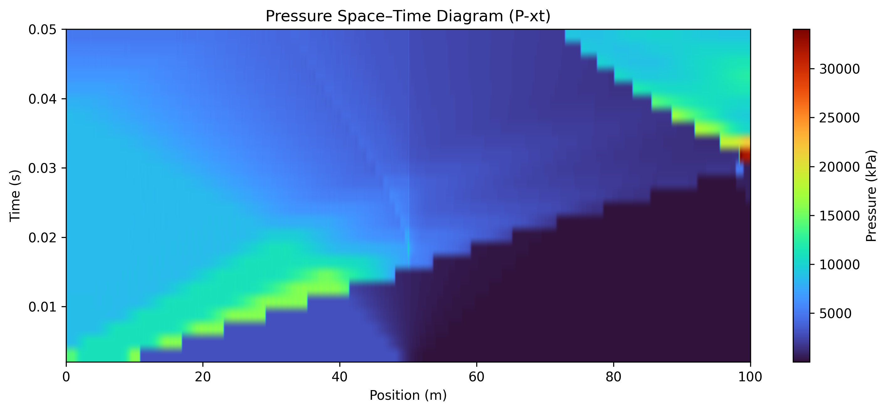
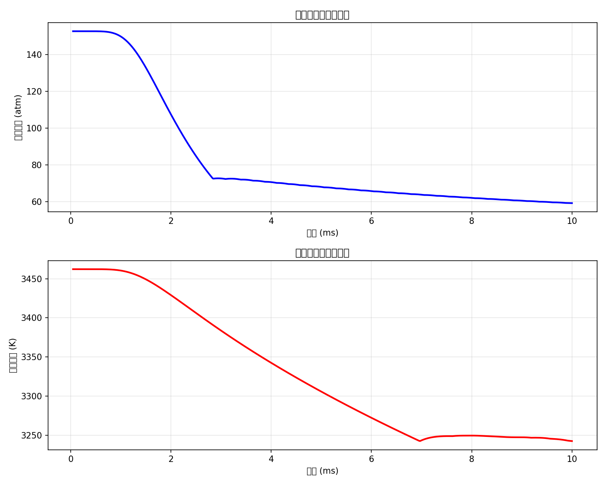

<div align="center">

# 🔬 CFD-Computational-Fluid-Dynamics

### CFD simulation — solvers and visualization.

Numerical schemes (MUSCL-RK3, WENO-RK3) and Cantera integration for computational fluid dynamics.

[](LICENSE)
[](https://www.python.org/)

</div>

---

**CFD-Computational-Fluid-Dynamics** is a collection of **CFD simulations**, solvers and visualization — featuring **MUSCL-RK3** and **WENO-RK3** schemes plus **Cantera** integration.

> [!NOTE]
> 中文项目：计算流体力学合集——CFD 仿真、求解器、可视化。

---

## Quickstart

```bash
git clone https://github.com/Windyhhh/CFD-Computational-Fluid-Dynamics.git
cd CFD-Computational-Fluid-Dynamics

pip install -r requirements.txt

# see docs for scheme-specific usage
# e.g. WENO-RK3: docs/WENO_RK3_使用指南.md
```

---

## Features

- **Numerical schemes** — MUSCL-RK3, WENO-RK3.
- **Cantera integration** — chemical-kinetics CFD.
- **Performance work** — CJ-speed optimization reports.

---

## Project Structure

```
CFD-Computational-Fluid-Dynamics/
├── docs/
│   ├── MUSCL_RK3_*.md          # MUSCL-RK3 implementation & tests
│   ├── WENO_RK3_*.md           # WENO-RK3 guide & summary
│   ├── Cantera集成方案实施报告.md
│   └── CJ速度优化*.md          # performance reports
└── README.md
```

---


## Results

<div align="center">
  
  
</div>

---
## License

MIT — free to use, modify and distribute.
